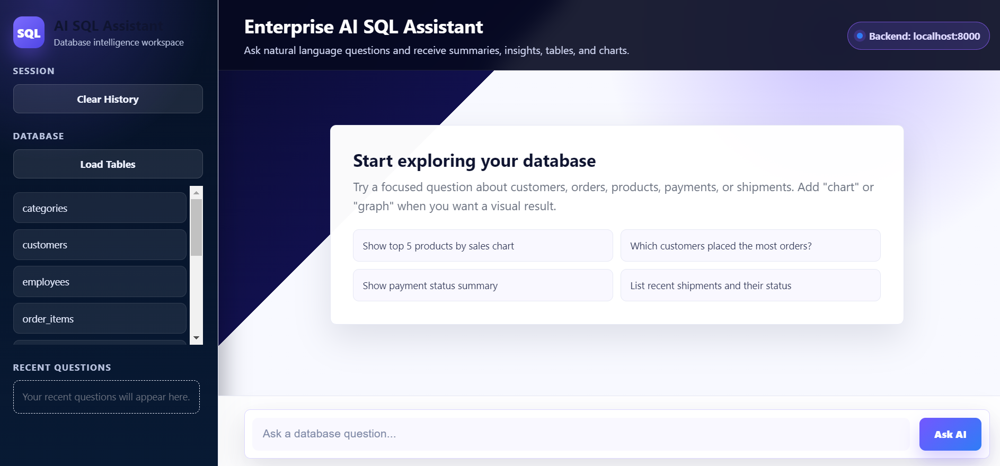
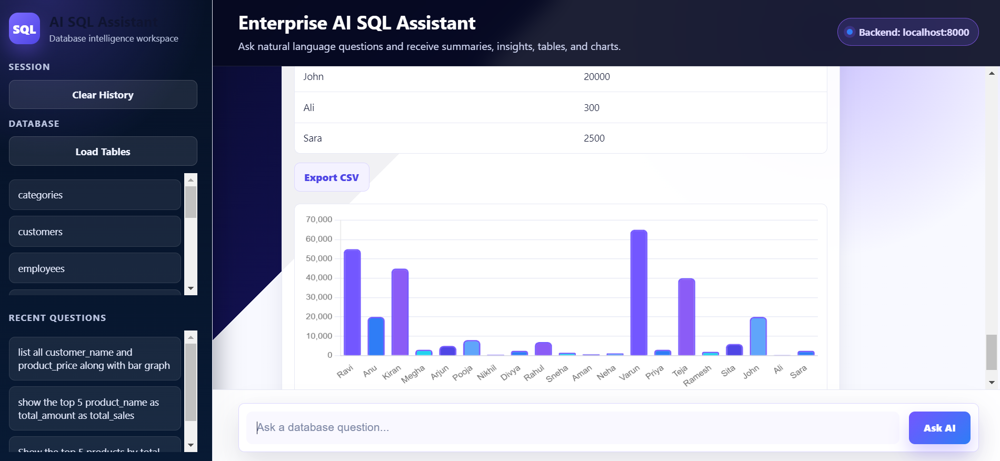

# Enterprise AI SQL Assistant

A FastAPI and vanilla JavaScript web app that lets users ask natural-language questions about a MySQL database. The assistant generates safe `SELECT` queries, returns table results, summarizes answers with Groq, supports CSV export, generates charts, and includes a simple database table browser.

## Features

- Natural-language database questions
- MySQL `SELECT` query generation
- AI summaries and insights
- Chart generation for graph/chart/plot questions
- CSV export for query results
- Sidebar database browser for viewing table contents
- Irrelevant-question guard for non-database prompts
- Clean frontend UI using plain HTML, CSS, and JavaScript

## Tech Stack

- Python
- FastAPI
- MySQL
- Groq API
- Sentence Transformers
- HTML, CSS, JavaScript
- Chart.js

## Project Structure

```text
ai_sql_chatbot/
├── frontend/
│   └── index.html
├── database.py
├── llm.py
├── main.py
├── rag.py
├── schema_guard.py
├── schema_loader.py
├── requirements.txt
├── .env.example
└── README.md
```

## Output Preview

Add your real app screenshots in a `screenshots/` folder and link them here.

```md


```

### Sample Question

```text
list all customer_name and product_price along with bar graph.
```

### Generated SQL

```sql
SELECT product_name, SUM(total_amount) AS total_sales
FROM orders
GROUP BY product_name
ORDER BY total_sales DESC
LIMIT 5;
```

### Sample Result

| Product Name | Total Sales |
| --- | ---: |
| Wireless Mouse | 125000 |
| Office Chair | 98000 |
| Laptop Stand | 76000 |
| Keyboard | 64500 |
| Monitor | 58000 |

### AI Summary

```text
Wireless Mouse has the highest total sales, followed by Office Chair and Laptop Stand. The top 5 products together show which items are contributing most to revenue.
```

## Environment Variables

Do not upload your real `.env` file to GitHub. It contains secrets.

Create your own `.env` file locally using `.env.example`:

```env
GROQ_API_KEY=your_groq_api_key_here

MYSQL_HOST=localhost
MYSQL_USER=root
MYSQL_PASSWORD=your_mysql_password_here
MYSQL_DB=ecommerce_ai
```

## Setup

1. Create and activate a virtual environment:

```bat
python -m venv venv
venv\Scripts\activate
```

2. Install dependencies:

```bat
pip install -r requirements.txt
```

3. Create `.env` from `.env.example` and add your real values.

4. Make sure MySQL is running and the database from `MYSQL_DB` exists.

## Run The App

Start the backend:

```bat
python -m uvicorn main:app --host 127.0.0.1 --port 8000
```

Open the frontend:

```text
frontend/index.html
```

Or serve it locally:

```bat
cd frontend
python -m http.server 5500
```

Then open:

```text
http://127.0.0.1:5500/
```

## API Endpoints

- `POST /ask` - ask a natural-language database question
- `GET /tables` - list database tables
- `GET /tables/{table_name}` - view table contents

## GitHub Upload Notes

The `.gitignore` file excludes:

- `.env`
- `venv/`
- `__pycache__/`
- local backup HTML files
- editor and OS files

Only upload source code and safe config examples.
